<div align="center">
  
#  Namaste, I'm **Sagar Gupta** 


[](https://sagar-gupta-portfolio-vhkwfkmny4zfgbn268mkgq.streamlit.app/)
[](https://linkedin.com/in/YOUR-LINKEDIN-USERNAME)
[](mailto:sagargupta585845@gmail.com)

</div>

---

## 🧑‍💻 About Me

```python
class SagarGupta:
    def __init__(self):
        self.username = "GuptaSigma"
        self.location = "Mumbai, India 🇮🇳"
        self.education = "Computer Science Undergraduate 🎓"
        self. interests = ["AI/ML", "Backend Development", "NLP", "Data Science"]
        self.current_focus = "Building ML-powered web applications"
        self.motto = "Focused on practical projects — no fake skills"
        self.portfolio = "https://sagar-gupta-portfolio-vhkwfkmny4zfgbn268mkgq.streamlit. app/"
    
    def say_hi(self):
        print("Thanks for dropping by! Let's build something amazing together 🚀")
    
    def get_skills(self):
        return {
            "languages": ["Python 🐍", "JavaScript 💛", "SQL 🗄️"],
            "ml_frameworks": ["Scikit-learn 🤖", "Pandas 🐼", "NumPy 🔢"],
            "web_frameworks": ["Flask 🌶️", "Streamlit 🎈"],
            "tools": ["Git 🔧", "VS Code 💻", "MySQL 🐬"]
        }

me = SagarGupta()
me.say_hi()
```


### 🔍 Quick Facts
- 🤖 **AI/ML & Backend Enthusiast**
- 💻 Building **real-world machine learning powered web applications**
- 📚 Learning by **building and deploying** actual projects
- 🎯 Actively improving **problem-solving skills**
- 🔬 Experience with **Scikit-learn, NLP, Flask, Streamlit**
- 🌱 Currently exploring **Deep Learning & Advanced NLP**
- 🌐 Check out my [**Portfolio Website**](https://sagar-gupta-portfolio-vhkwfkmny4zfgbn268mkgq.streamlit. app/) 🚀

<br clear="right"/>

---

## 🛠️ Tech Stack & Skills

<div align="center">

### 🌐 Web & Backend Development


### 🤖 AI / Machine Learning


### 🗄️ Database & Tools


</div>

<div align="center">
  
  
  
  
  
</div>

---

## 📊 GitHub Analytics

<div align="center">
  
  
</div>

<div align="center">
  
</div>

<div align="center">
  
</div>

---

## 🏆 GitHub Trophies

<div align="center">
  
</div>

---

## 🚀 Featured Projects

<div align="center">

<table>
<tr>
<td width="50%">

### 🎯 SMART Resume Analyzer
<a href="https://github.com/GuptaSigma/smart-resume-analyzer">

</a>

**🤖 An intelligent resume screening system powered by Machine Learning**

#### 💡 Tech Stack: 


#### ✨ Key Features:
- ✅ **ML-based Job Matching** 🎯
- ✅ **TF-IDF Similarity Scoring** 📊
- ✅ **Real-time Predictions** ⚡
- ✅ **Email Automation** 📧
- ✅ **Database Integration** 🗄️

#### 🎯 Technical Highlights:
- 🧠 **NLP** for text preprocessing
- 📈 **TF-IDF vectorization** for features
- 🔍 **Cosine Similarity** for matching
- 🌐 **Flask RESTful APIs**

<div align="center">

[](https://github.com/GuptaSigma/smart-resume-analyzer)
[](#)

</div>

</td>
<td width="50%">

### 📧 Spam Email Detector
<a href="https://github.com/GuptaSigma/spam-email-detector">

</a>

**🛡️ Email spam classification system using Machine Learning**

#### 💡 Tech Stack:


#### ✨ Key Features: 
- ✅ **Naive Bayes Classification** 🤖
- ✅ **Interactive Web Interface** 🌐
- ✅ **Performance Metrics** 📊
- ✅ **Real-time Predictions** ⚡
- ✅ **Text Preprocessing Pipeline** 🔧

#### 🎯 Technical Highlights:
- 🎯 **95%+ accuracy** achieved
- 🧹 **Text cleaning** & tokenization
- 📝 **CountVectorizer** features
- 🎈 **Streamlit** web app

<div align="center">

[](https://github.com/GuptaSigma/spam-email-detector)
[](#)

</div>

</td>
</tr>
</table>

</div>

---

## 💼 What I'm Currently Working On

```mermaid
graph LR
    A[🧠 Learning] --> B[Deep Learning 🔥]
    A --> C[Advanced NLP 📚]
    A --> D[MLOps 🔧]
    E[💻 Building] --> F[ML Web Apps 🌐]
    E --> G[Backend APIs ⚡]
    E --> H[Data Pipelines 📊]
    
    style A fill:#ff6b6b,stroke:#333,stroke-width: 2px,color:#fff
    style E fill:#4ecdc4,stroke:#333,stroke-width:2px,color:#fff
    style B fill:#ffe66d,stroke:#333,stroke-width:2px,color:#333
    style C fill:#ffe66d,stroke:#333,stroke-width:2px,color:#333
    style D fill:#ffe66d,stroke:#333,stroke-width:2px,color:#333
    style F fill:#95e1d3,stroke:#333,stroke-width:2px,color:#333
    style G fill:#95e1d3,stroke:#333,stroke-width:2px,color:#333
    style H fill:#95e1d3,stroke:#333,stroke-width:2px,color:#333
```

<div align="center">



</div>


### 🎯 Current Focus: 
- 🔭 Exploring **Deep Learning** frameworks (TensorFlow 🧠, PyTorch 🔥)
- 🌱 Learning **Advanced NLP** techniques (Transformers 🤗, BERT 📚)
- 👯 Open to collaborate on **AI/ML projects** 🤝
- 💬 Ask me about **Python 🐍, Machine Learning 🤖, Flask 🌶️, NLP 📝**
- 📫 Reach me at: **sagargupta585845@gmail.com** 📧
- 🌐 Visit my **[Portfolio](https://sagar-gupta-portfolio-vhkwfkmny4zfgbn268mkgq.streamlit. app/)** 🚀

---

## 📈 Coding Activity

<div align="center">
  
<!--START_SECTION:waka-->
<!--END_SECTION:waka-->


</div>

---

## 🌐 Portfolio & Links

<div align="center">

<a href="https://sagar-gupta-portfolio-vhkwfkmny4zfgbn268mkgq. streamlit.app/">

</a>

<br><br>

**🎨 Built with Streamlit | 🚀 Showcasing Real Projects | 💼 Professional Experience**


</div>

---

## 🤝 Connect With Me

<div align="center">

<table>
<tr>
<td align="center" width="200">
<a href="https://sagar-gupta-portfolio-vhkwfkmny4zfgbn268mkgq. streamlit.app/">

<br>
<sub><b>Portfolio Website</b></sub>
</a>
</td>
<td align="center" width="200">
<a href="https://linkedin.com/in/YOUR-LINKEDIN-USERNAME">

<br>
<sub><b>LinkedIn</b></sub>
</a>
</td>
<td align="center" width="200">
<a href="mailto:sagargupta585845@gmail.com">

<br>
<sub><b>Email Me</b></sub>
</a>
</td>
<td align="center" width="200">
<a href="https://github.com/GuptaSigma">

<br>
<sub><b>GitHub Profile</b></sub>
</a>
</td>
</tr>
</table>

<br>

[](https://sagar-gupta-portfolio-vhkwfkmny4zfgbn268mkgq.streamlit.app/)
[](https://linkedin.com/in/YOUR-LINKEDIN-USERNAME)
[](mailto:sagargupta585845@gmail.com)
[](https://github.com/GuptaSigma)

</div>

---

<div align="center">

### 📊 Profile Stats


</div>

---

<div align="center">


### 💡 *"Building AI solutions that matter, one project at a time"* 🚀


### ⭐ From [GuptaSigma](https://github.com/GuptaSigma) with ❤️

**Show some ❤️ by starring my repositories! **


</div>

---

<div align="center">

**📌 Fun Fact:** I believe in learning by doing! Every project in my portfolio solves a real-world problem 🎯


</div>
